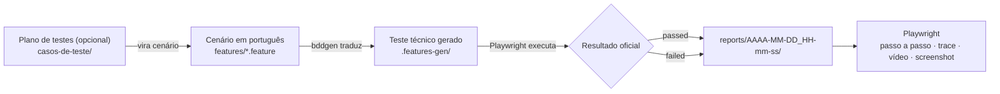

# Visão Geral do Projeto
---

## 1. Para que serve

Este é um serviço de criação e automação de testes com suporte de IA (Agente Claude Code) onde é possivel:

Solicitar que seja criado um plano de teste e os respectivos casos de teste em BDD, informando os detalhes da funcionalidade (Caso de Uso, requisitos, estorias de usuário, critérios de aceite, etc). Desta forma, o Agente cria todos os cenários, considerando a cobertura necessaria e apresenta uma Matriz de Rastreabilidade de Requisitos, bem como os testes no padrão Gherkin (Dado/Quando/Então)

ou,

Escrever/anexar os cenários/casos de teste em português de forma natural (não necessariamente em BDD) e solicitar ao Agente que implemente a automação e execução (opcional) → o Playwright executa → gera Relatório do Playwright contendo os resultados `passed` ou `failed` e, se falhar, incorpora vídeo/screenshot de evidência.

## 2. O mapa mental: as pastas que importam

De tudo que existe no repositório, estas pastas concentram o que é relevante para quem pensa
em termos de negócio:

| Pasta | O que é |
|---|---|
| `planos-de-teste/` | **O que você planeja (opcional).** A cobertura de testes discutida e priorizada, com os casos já identificados e numerados (`CT-01`, `CT-02`...), antes de virar cenário executável. |
| `features/` | **O que você escreve.** Os cenários em português (`.feature`), o único lugar onde a intenção de negócio vive. |
| `steps/` | **O vocabulário que o robô entende.** Cada frase do cenário (`Dado`, `Quando`, `Então`) tem uma implementação aqui, em TypeScript, escondida do lado funcional. |
| `reports/` | **O que você recebe.** Uma pasta por execução, com data e hora, contendo os relatórios e as evidências dessa execução específica. |

Tudo o mais (`playwright.config.ts`, `.features-gen/`, `node_modules/`, `package.json`) é
infraestrutura de suporte — necessária, mas não é onde a intenção de negócio é expressa nem
onde o resultado é lido.

## 3. Como um teste nasce e roda



Passo a passo:

0. Opcionalmente, por solicitação, é construido um
   plano em `planos-de-teste/`, produzido pela Skill `playwright-test-planning`.
1. A partir do Plano de Teste ou a partir de solicitação do usuário contendo os cenarios/casos de teste, cada teste é escrito (ou ajustado) em um arquivo `.feature`, em português, com
   `Dado` / `Quando` / `Então`.
2. O `bddgen` traduz esse português para um teste técnico executável, guardado em
   `.features-gen/` — uma pasta gerada automaticamente, nunca editada à mão.
3. O Playwright executa esse teste, contra o site ou serviço alvo.
4. Cada execução grava seus relatórios e evidências em uma pasta própria, nomeada com a data
   e hora exatas (`reports/2026-09-04_11-10-37/`, por exemplo) — a execução anterior nunca é
   apagada ou sobrescrita.

## 4. As duas trilhas: Web e API

O projeto automatiza dois tipos de coisa, mantidos propositalmente separados:

| | Trilha Web | Trilha API |
|---|---|---|
| O que testa | Páginas e formulários de um site | Respostas de um serviço (chamadas HTTP) |
| O que você escreve | Cenário em `features/*.feature` | Cenário em `features/api/**/*.feature` |
| Vocabulário (steps) | `steps/*.ts` | `steps/api/**/*.ts` |
| Precisa de navegador? | Sim — chromium (default), firefox ou webkit sob pedido | Não |

As duas trilhas são compiladas e executadas de forma independente, para que um ajuste em uma
nunca interfira na outra. A cobertura completa de cada uma está detalhada na próxima seção.

## 5. Como pedir uma execução

O pedido é feito em linguagem natural ao Claude — por exemplo, "rode os cenários CT01 e CT02 do Plano X" ou
"rode toda a suite de testes X". Um pedido Web que não especifica navegador roda em `chromium` por
padrão. Por trás, isso vira um comando Playwright equivalente a:

```
npx bddgen
npx playwright test --project=chromium --grep "@ferias"
```

Formas de escopar a execução:

- **Por trilha/navegador** — `chromium`, `firefox`, `webkit` (Web) ou `api`.
- **Por tag** — exemplo: `@ferias`, `@rescisao`, ou outra tag atribuída ao cenário. 
- **Por título do cenário** — pedindo exatamente o cenário desejado.
- **Tudo** — quando nenhum recorte é pedido, roda a suíte inteira.

## 6. Onde ver o resultado

Cada execução real grava um relatório em `reports/<data-hora>/playwright/index.html` — inclui o
passo a passo de cada cenário (`Dado`/`Quando`/`Então`), o diff de qualquer asserção que tenha
falhado, e trace/vídeo/screenshot de qualquer passo que tenha falhado.

Vídeo, screenshot e trace só são gravados quando o teste falha — é o comportamento
configurado para não acumular evidência desnecessária em execuções bem-sucedidas.

Um cenário também pode aparecer como `skipped` em vez de `passed`/`failed`. Isso acontece
quando um `Dado` depende de um registro de massa pré-existente (por exemplo, um produto com
desconto ou sem estoque) e esse registro não é encontrado no ambiente no momento da execução —
o relatório registra o motivo.

## 7. Como o serviço se governa

As regras que orientam como o Claude Code trabalha neste projeto apresenta-se em três níveis, cada uma
com uma função diferente:

1. **`CLAUDE.md`** — as regras permanentes e inegociáveis do projeto (preservar o cenário
   como dado, não reexecutar por conta própria, BDD em português, credenciais fora do
   repositório, entre outras).
2. **Skills (`.claude/skills/`)** — o procedimento passo a passo para uma tarefa específica:
   planejar os cenários de teste, rodar a suíte, explorar uma página antes de escrever um step,
   explorar um endpoint de API, atualizar o repositório no GitHub.
3. **Diretrizes (`docs/DIRETRIZES_AUTOMACAO_PLAYWRIGHT_BDD_CLAUDE.md`)** — o detalhamento
   técnico consultado apenas quando as regras e a Skill não bastam.

Cada regra existe em um único desses lugares — não há duplicação entre elas. 

## 8. Fundamentos da arquitetura

- **Superfície de edição realmente estreita.** No dia a dia, só é necessário mexer em
  arquivos `.feature`, em português — o resto é infraestrutura que o usuário funcional não
  precisa tocar.
- **Governança madura e sem duplicação**, nos três níveis descritos acima.
- **Evidência por execução, sem sobrescrita.** Cada execução tem sua própria pasta com
  timestamp; nada se perde entre uma execução e a próxima.
- **Um único relatório, sem redundância.** Um só formato para manter, sem dúvida sobre qual é
  a fonte de verdade.
- **Falha real e impedimento de execução não se confundem.** Quando uma pré-condição de massa
  não é encontrada, o cenário é marcado como `skipped`, com o motivo registrado — nunca como
  `failed` por uma exceção não tratada. Isso mantém o relatório confiável: um `failed` sempre
  aponta um comportamento real da aplicação que divergiu do esperado.
- **Trilhas Web e API isoladas** Evita que aja falhas e confusão de tratamento.
- **Segredos fora do código.** As credenciais da trilha de API (`API_BASE_URL`,
  `API_AUTH_TOKEN`, `API_AUTH_USERNAME`, `API_AUTH_PASSWORD`) vêm de variáveis de ambiente; o
  repositório traz apenas um `.env.example` como modelo, nunca valores reais — o `.env` com as
  credenciais de verdade fica fora do controle de versão. Se uma variável obrigatória estiver
  ausente, a execução para com uma mensagem clara, nunca um erro técnico genérico.
- **Cenários organizados por funcionalidade, testando múltiplas aplicações lado a lado.**
  diferentes funcionalidades convivem
  em arquivos `.feature` separados sem interferir entre si, e a busca por cenários da trilha
  Web é recursiva — pronta para agrupar cada área de negócio em sua própria subpasta assim que
  a quantidade justificar.

## 9. Glossário

| Termo | Significado |
|---|---|
| Gherkin | A linguagem estruturada usada para escrever cenários com `Dado`/`Quando`/`Então`. |
| Cenário | Um caso de teste completo, escrito em português em um arquivo `.feature`. |
| Step | A implementação (em TypeScript) de uma frase do cenário. |
| Tag | Uma etiqueta (`@ferias`, `@rescisao`) usada para agrupar e selecionar cenários. |
| Trilha | Um agrupamento independente de execução — hoje, Web ou API. |
| `bddgen` | Ferramenta que traduz os arquivos `.feature` em testes executáveis pelo Playwright. |
| Trace | Um registro detalhado passo a passo de uma execução, usado para investigar uma falha. |
| Fixture | Um recurso preparado e isolado para um teste (por exemplo, o estado de uma chamada de API dentro de um cenário). |
| Project | Um agrupamento de configuração no Playwright (por exemplo, `chromium` ou `api`). |
| `skipped` | Resultado de um cenário que não pôde ser executado por faltar uma pré-condição de massa (não por falha de comportamento da aplicação); o motivo fica registrado no relatório. |
